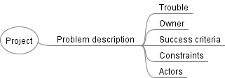

# Unit 1: Describing the Problem

## What are digital problems

> Problem solving in technology-rich environments involves using digital technology, communication tools and networks to acquire and evaluate information, communicate with others and perform practical tasks. It requires the ability to solve problems for personal, social and economic purposes through the setting of appropriate goals and plans and by the accessing and making use of information through computers and computer networks.{cite}`PIAAC_2009`

> Digital problems are therefore those problems that are solvable using information and communication technologies. These digital solutions can use a wide variety of developed and developing contexts such as web applications, mobile applications, interactive media and intelligent systems. {cite}`qcaa_2017_digital`

What distinguishes a digital problem is that the solution consists of digital hardware and software working together to form a digital system.

In a digital system:
- data goes in (input)
- data is manipulated (process)
- data is sent out (output)

## Describing the problem
Describing the problem is an important first step in developing a digital solution. There are uncountable examples of failed solutions due to the designer solving a different problem to the one they were supposed to solve. Therefore the first step in our problem solving process is to clearly, and succinctly.

To describe the problem we will use the TOSCA framework {cite}`garrette_2018_cracked`. TOSCA is an abbreviation for Trouble, Owner, Success Criteria, Constraints and Actors.

- **Trouble**: What indicates the current situation is not the desired one?
- **Owner**: Who is responsible for its resolution?
- **Success**: What will success look like and when?
- **Constraints**: What are the binding constraints on developing a solution?
- **Actors**: Who are the relevant stakeholders?

We do this using our mind map. The problem description branch can be seen below.

Ultimately, this is an initial sketch of the problem which we will investigate in further detail throughout the Exploration phase.