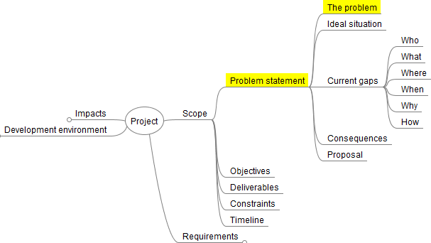

# Unit 2: Describing the Problem

When describing the problemyou will need to consider the data aspect, in addtion to the requirements from Unit 1.

## The nature of data-driven problems
> Data can be enormously helpful with formulating policies, providing services and performing government tasks. This is something that we will tackle systematically. Taking a data-driven approach refers to the systematic collection, management, analysis, interpretation and application of data. {cite}`nldigibeter_2019_problem`

Data driven solutions have the following characteristics:
- They access data that has been colleceted
  - This data may be collect by the solution or retrieved from a third-party
  - Quality of the data is important than the quanity
- They query the data
  - The storage of the data must enable the querying of the data
- They interpret the data
  - Analysis of the retrieved data to provide insight.

### The DIKW Pyramid
> The DIKW Pyramid is introduced is use to understand the way data is converted to wisdom, which is the one overall goal of data.{cite}`dataliteracy_2020_11`

Data needs to be tranformed to become meaningfoul and meet the needs of the user. This process is represented by the DIKW Pyramid.

<iframe width="560" height="315" src="https://www.youtube.com/embed/u9DoQ9gY4z4" title="YouTube video player" frameborder="0" allow="accelerometer; autoplay; clipboard-write; encrypted-media; gyroscope; picture-in-picture" allowfullscreen></iframe>

In summary:
- **data:** clear and definitive facts
- **information:** data + the context that data is found in
- **knowledge:** information + experience that relates to this kind of information
- **wisdom:** knowledge + action in response to the new knowledge

Consider this example for the DIWK Pyramid in action
- **data:** 3000mm
- **information:** 3000mm is the legth of a timber board I am buying
- **knowledge:** previously I could not fit a 2600mm timber board in my car
- **action:** I will have to get the board delieverd

### What is data-driven programming
For the purposes of this course, data-driven programming filters, transforms and aggregates structured data.

## Working with data
A data driven application can be though as having three different viewing layers:
- **External layer:** 
  - what the end user will see (UI)
  - ensure the data is represented in a way that enhances understanding
- **Internal layer:** 
  - relates to the underlying operational and physical storage such a file systems, management systems etc. 
  - modern computer technologies automate this process.
- **Logical layer:**
  - conceptually sits between exteral layer and internal layer
  - relates to how data is stored that ensures:
    - **data integrity:** data is maintained to to continue to have meaning and value
    - **data reliablity:** the abilty to trust that data accurately reflects the facts descriptions or actions it is representing
    - **data validity:** the data meets defined formats, rules and criteria or order to maintain integrity and reliablity
  - usually symbolic or structured representations that show links between data
---
## Changes to the Problems statement
From Unit 2 in establishing the scope of your project you will need to also consider the data involved. Specficically you will need incorporate the problem's data driven nature as part of the problem description.

