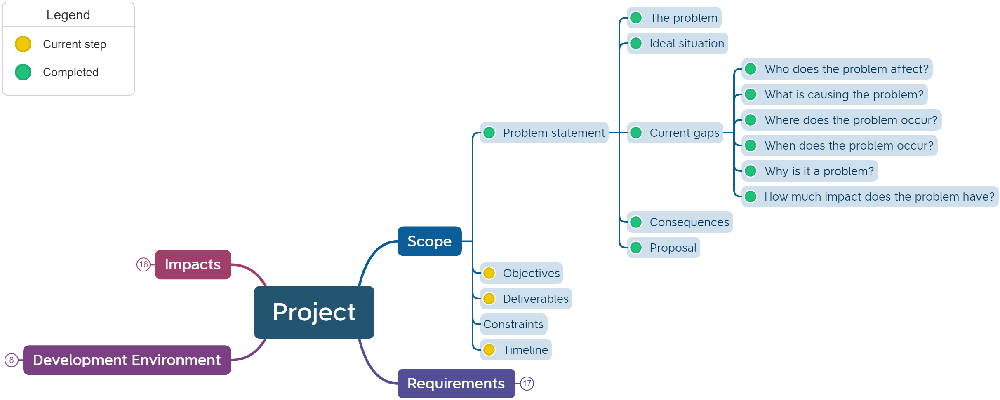
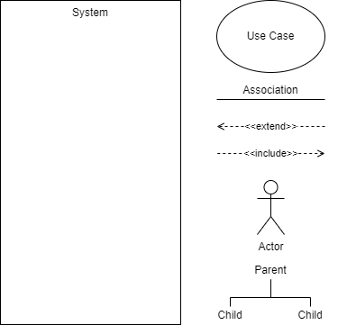

# Unit 1: Analyse the Problem

## Computational thinking
> Computational thinking describes the processes and approaches we draw on when thinking about how a computer can help us to solve complex problems and create systems. We often draw on logical reasoning, algorithms, decomposition, abstraction, and patterns and generalisation when thinking computationally. {cite}`digitaltechnologieshub_topics`

### Decomposition
Decomposition is the process of breaking down complex problems into smaller, more manageable parts. With decomposition, problems that 
seem overwhelming at first become much more manageable. Problems we encounter are ultimately comprised of smaller problems we can more easily address. This process of breaking down problems enables us to analyze the different aspects of them, ground our thinking, and guide ourselves to an end point.

When decomposing, ask:
- What are the different parts of the problem you are trying to solve?
- What are the different tasks that I need to do to solve this problem?
- Can I easily complete each of tasks? If not, how can they be broken down further?
- If I complete all the sub-tasks, will the problem be solved?

### Pattern Recognition
As it sounds, pattern recognition is all about recognizing patterns. Specifically, with computational thinking, pattern recognition occurs 
as people study the different decomposed problems.

Through analysis, students recognize patterns or connections among the different pieces of the larger problem. These patterns can be 
both shared similarities and shared differences. This concept is essential to building understanding amid dense information and goes 
well beyond recognizing patterns amongst sequences of numbers, characters, or symbols. 

When recognising patterns, ask:
- Are there any patterns that you observe?
- Do you notice any similarities between this problem and something else you have already solved?
- Do any of the parts of this problem share qualities?
- Does anything repeat?

### Abstraction
Also called, pattern generalization, abstraction enables us to navigate complexity and find relevance and clarity at scale. Decomposition and pattern recognition broke down the complex, and abstraction figures out how to work with the different parts efficiently and accurately. This process occurs through filtering out the extraneous and irrelevant in order to identify what’s most important and connect each decomposed problem.

Abstraction is similar to the selective filtering function in our brains that gates the neural signals with which we are constantly 
bombarded so we can make sense of our world and focus on what’s essential to us.

When abstracting, ask:
- What are you trying to solve?
- Which details are important in solving this problem?
- What can you leave out? What information is unnecessary?
- Can you describe this problem as something more basic?

### Algorithmic Thinking
An algorithm is a process or formula for calculating answers, sorting data, and automating tasks; and algorithmic thinking is the process for developing an algorithm.

With algorithmic thinking, students endeavor to construct a step-by-step process for solving a problem so that the work is replicable by humans or computers. Algorithmic thinking is a derivative of computer science and the process to develop code and program applications. This approach automates the problem-solving process by creating a series of systematic, logical steps that intake a defined set of inputs and produce a defined set of outputs based on these. 

In other words, algorithmic thinking is not solving for a specific answer; instead, it solves how to build a sequential, complete, and 
replicable process that has an end point – an algorithm. Designing an algorithm helps students to both communicate and interpret clear 
instructions for a predictable, reliable output. As was said earlier, this is the crux of computational thinking.

Then creating algorithms, ask:
- What’s the first step you can take to solve this problem?
- What are the steps that you need to do to solve this problem?
- In what order should you complete those steps?

---
## Systems thinking
> A system is a set of interrelated elements that make a unified whole. Systems are everywhere — for example, the interdisciplinary team involve in supporting someone, the Human Resources in your organization, the circulatory system in your body, the predator/prey relationships in nature, the ignition system in your car, and so on. Ecological systems and human social systems are living systems; human-made systems such as cars and washing machines are nonliving systems. {cite}`persondirectclinicalservice_2017_system`

Systems thinking is a holistic approach to the identification and solving of problems, where parts and components of a system, their interactions and interrelationships are analysed individually to see how they influence the functioning of the whole system. This approach enables the understanding of systems and working with complexity, uncertainty and risk. It requires identifying and making connections between solutions, systems and society. Systems thinking also requires the identification and examination of interactions between different components of a system. Essential to this is the understanding of the interdependence between information systems and how a change or output from one system can affect another, and how this affects larger systems such as the economy and society.

In this course we will engage in systems thinking by addressing scope, constraints, limitations and requirements.

--- 
## Scope
We have already discussed that scope includes:
- **Problem Statement** - The problem statement is an overall descriptive statement about what needs to be solved. It includes a justification for the project (explains why is it being undertaken in the first place).
- **Objectives** - These are the overall project goals that will meet the needs of your customers.
- **Deliverables** - The deliverables are the objects are that need to be produced. 
- **Constraints and Limitations** - What are the barriers or things that must be adhered to? These are the requirement specifications for the project.
- **Timeline** - How long the project will run for and any specific milestones or checkpoints along the way.

We have already sketched out our Problem Statement. Remember, this process is not linear. If you think of additional points to add to the Problem Statement, then go back and add them.

Now that we better understand our users and their needs, we can complete some more of the scope on our mind map.

### Objectives
What are the project's overall goals that will meet the needs of your customers. These describe the primary impacts that your solution will have on the users. For example, is your objective to entertain the user, to make them more efficient or to improve their heath?

### Deliverables
What are the objects are that you need to produced? This may be the final product, or it may be a milestone towards this product. 

In Unit 1 you will have two different deliverables:
- For FIA1 you will need to deliver a technical proposal
- For FIA2 you will need to deliver a program prototype

### Timeline
How long the project will run for? What are the specific milestones or checkpoints along the way? Each criteria sheet you will receive, will contain explicit checkpoints.

---
## Use Case Diagram
> In the Unified Modelling Language (UML), a use case diagram can summarize the details of your system's users (also known as actors) and their interactions with the system. To build one, you'll use a set of specialized symbols and connectors. {cite}`lucidchart_2019_uml`
 
An effective use case diagram can help you represent:
- Scenarios in which your system or application interacts with people, organizations, or external systems
- Goals that your system or application helps those entities (known as actors) achieve
- The scope of your system

We will employ Use Case Diagrams to further develop our exploration of the problem.

Watch **[this video](https://youtu.be/zid-MVo7M-E)** to learn how to create a Use Case Diagram.

### Steps to create a Use Case Diagram
1. What is the system being created?
2. Who are the actors using the system? (People, Organisations, Other systems, External devices)
3. Is each actor a primary actor or a secondary actor?
4. What actions will the primary actors want to do with the system?
5. How will each actor interact with the use cases?
6. Are the any new actions automatically connected to current use cases?
7. Are there any additional, optional actions connected to current use cases?
8. Do any use cases or actors have sub categories?

### Use Case Diagram Symbols
