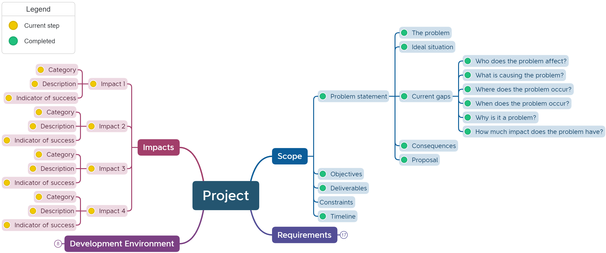

# Select Impacts

```{admonition} Tools used:
:class: attention
- mind maps
```
## For Units 1 to 4
When selecting impacts the developer needs to consider what they hope to achieve with the solution.

This decision is recorded in the mind map.



```{admonition} Unit 1 subject matter covered:
- understand and describe personal, social and economic impacts
{cite}`queenslandcurriculumassessmentauthority_2017_digital`
```

```{admonition} Unit 2 subject matter covered:
- explore and communicate the personal, social and economic impacts of storing data in a database for individuals, organisations and governments
- recognise the elements needed for a data-driven solution, including the personal, social and economic impacts of storing data in databases for individuals, organisations and governments
{cite}`queenslandcurriculumassessmentauthority_2017_digital`
```

```{admonition} Unit 3 subject matter covered:
- determine possible personal, social and economic impacts
{cite}`queenslandcurriculumassessmentauthority_2017_digital`
```

```{admonition} Unit 4 subject matter covered:
- evaluate security impacts of data and its use, dissemination, storage, accuracy and ownership on personal, social and economic needs
{cite}`queenslandcurriculumassessmentauthority_2017_digital`
```