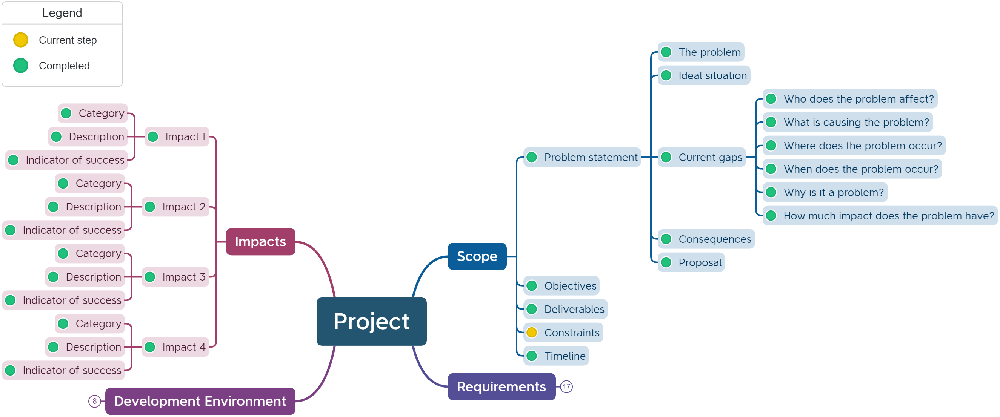

# Identify Constraints

```{admonition} Tools used:
:class: attention
- mind maps
```
## For Units 1 to 4
You will need to identify the parameters that you will be working within, such as the constraints and limitations placed on your project.

This information is recorded in the mind map.



```{admonition} Unit 1 subject matter covered:
- analyse a given problem to identify constraints and limitations of the environment
{cite}`queenslandcurriculumassessmentauthority_2017_digital`
```

```{admonition} Unit 4 subject matter covered:
- determine manageable aspects of a problem through a decomposition and analysis of constraints
{cite}`queenslandcurriculumassessmentauthority_2017_digital`
```