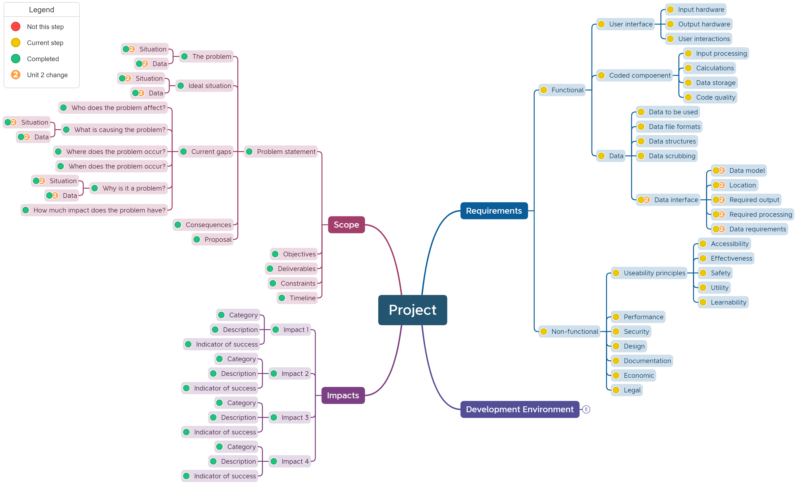

# Unit 2: Identify Requirements

In addition to the requirements from Unit 1, you also need to consider

## Programming options

### Data models

> Data modeling (data modelling) is the process of creating a data model for the data to be stored in a database. This data model is a conceptual representation of Data objects, the associations between different data objects, and the rules. {cite}`taylor_2018_what`

It is defined as an abstract model that organizes:

- data description
- data semantics
- consistency constraints

Data models emphasizes on what data is needed and how it should be organized instead of what operations will be performed on data.

The primary goal of using data model are:

- ensuring that all data objects required by the database are accurately represented.
- help designing the database at the logical level
- defining the relational tables, primary and foreign keys and stored procedures.\
- providing a clear picture of the base data and can be used by database developers to create a physical level
- identifying missing and redundant data
- making IT infrastructure upgrades and maintenance cheaper and faster

In this course we will be creating data models using Entity Relationship models.

### Storage

Data storage requirements can relate to either policies and procedures that need to be adhered to for
the safe storage, use and destruction of data and also to the physical and software requirements of
storing that information.

The safe storage of data is atopic that will be more closely investigated in Unit 4. For Unit 2 we are concern with storing data in way that ensures:

- data integrity
- data validity
- data reliability

You will need to consider:

- Where will the data be stored (locally or remotely on a server)?
- What file format will be used to store the data?
- How will the data be backed-up?
- What security will the data need?

### Output requirements

The problem will have some explicit output requirements. What does the user need the application to provide?

Identifying the output requirements, will help determine the data needed, and identify any missing data.

---

## Data Insertion

In order to be able to store data into a database there are a number of important processes that need to be followed to make sure that the data that is stored is usable.

These issues can relate to variations in data formats, data structures, validation rules and data
requirements.

### Data formats

The storage of data needs to be consistent. That means the way that one data point is stored is the same from record to record. For example 100,000 and $10^5$ are the same number, but they are formatted differently. Before designing a database and storing data, the accepted format of this data needs to be decided.

Some common data formats that need to be established:

- **Dates:**
  - dates have the widest range of accepted range of formats
  - date formatting is represented by:
    - d: day
    - m: month
    - y: year
  - common date formats (example is 13th August 1984):
    - dd/mm/yyyy    13/08/1984
    - dd/mm/yy      13/08/84
    - d/m/yy        13/8/84
    - mm/dd/yyyy    08/13/1984 (US date style)
    - yyyymmdd      19840813
- **Time:**
  - time of day also has a range of accepted formats
  - time of day formatting is represented by:
    - H: 24hr hour
    - h: 12hr hour
    - m: minute
    - s: second
    - A: AM or PM
  - common time of day formats (example is 1:15pm)
    - HH:mm     13:15
    - hh:mmA    01:15pm
    - h:mmA     1:15pm
- **Numbers:**
  - numbers and are often formatted in a specific way (eg. phone numbers and currency) or may be expected to have specific number of places after the decimal point.
  - numbers formatting is represented by:
    - 0: required digit between 0 and 9
    - 9: optional number between 0 and 9
  - common number formats:
    - mobile number:    0000 000 000
    - landline number:  (00) 0000 0000
    - postcode:         0000
    - currency:         $ 90.00

### Data structures

The two basic data structures that this course deals with are:

- **flat file databases:** information is stored in a single table
- **relational databases:** information is stored in many, interconnected tables

This course will be dealing with relational databased, but the source data may be in a flat file database. Data from flat file databases will have to be parsed to be converted into the form acceptable for the relational database.

### Validation rules

Data can have a limited range of acceptable values. Validation rules restrict data values to within these limitations.

The limitations may be length, types of characters, range of numerical values or more. The data being sourced needs to validated against these limitation before it can be entered into the database.

Examples:

- mobile numbers requiring 10 digits
- passwords requiring 8 characters or more, at least one uppercase and lower case, at least one digit
- the quantity of an item in a sale has to be less than the number of that item in stock
- age must be greater than 0

### Data requirements

Before developing a database you will need to identify all the data that will need to be stored in the database. This is **vital**. Once a database is implemented and in use, it is a painstaking task to make significant changes to the data structure.

---

## Adding to the mind map

In the Explore Phase you need to consider both programming options and insertion problems and record the identified requirements in the mind map.

You will need to consider the following issues:

- data accuracy
- data completeness
- data models
- storage
- output requirements
- data formats
- validation rules
- data requirements
