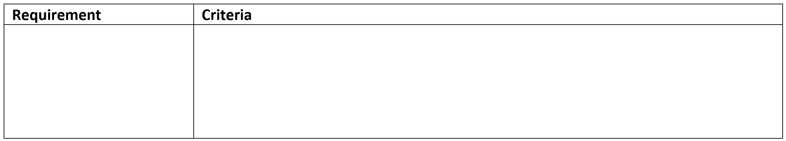

# Determine Criteria

```{admonition} Tools used:
:class: attention
- criteria table
```

The final step in the Explore phase is to determine the criteria that will be used to measure whether your solution is successful. You will need to consider the prescribed criteria provided to you, as well as any additional self-determined criteria.

This information is recorded in the criteria table which provides clear guidance in how to measure the successful attainment of the criteria.



```{admonition} Unit 1 subject matter covered:
- analyse a given problem to identify prescribed and self-determined criteria to evaluate the personal, social and economic impacts of the solution
{cite}`queenslandcurriculumassessmentauthority_2017_digital`
```