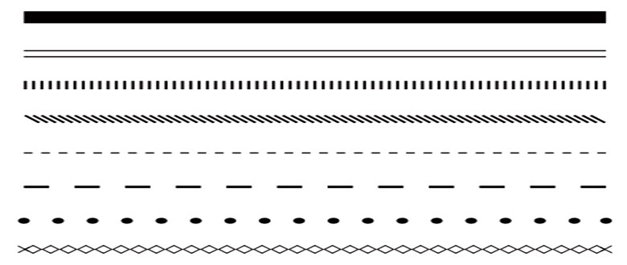
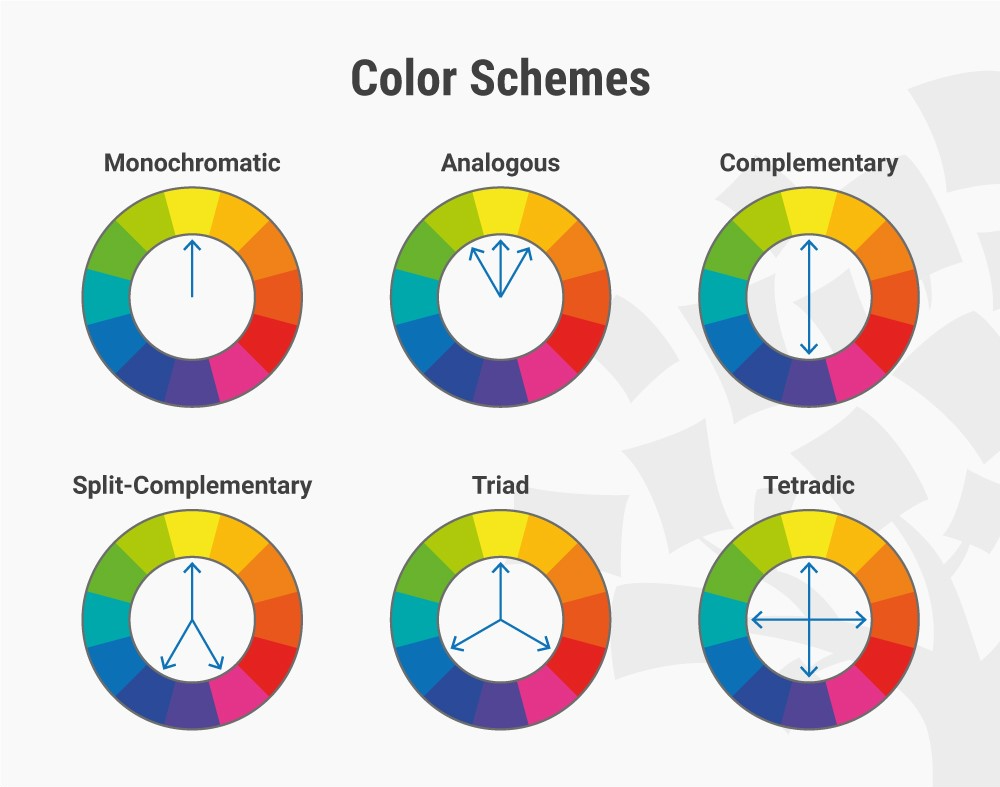
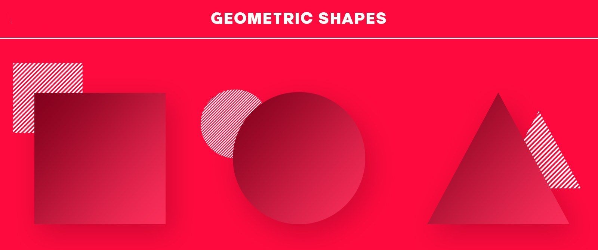
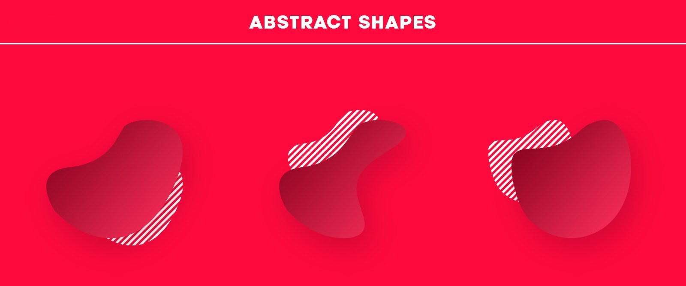
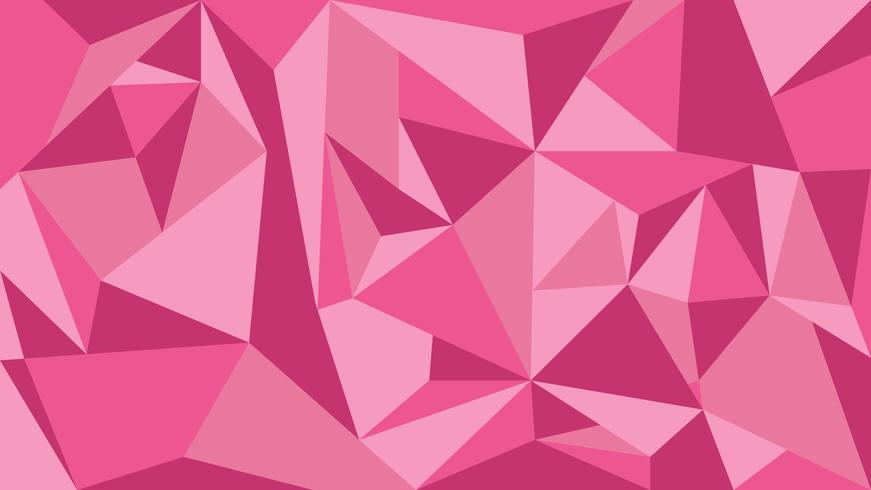
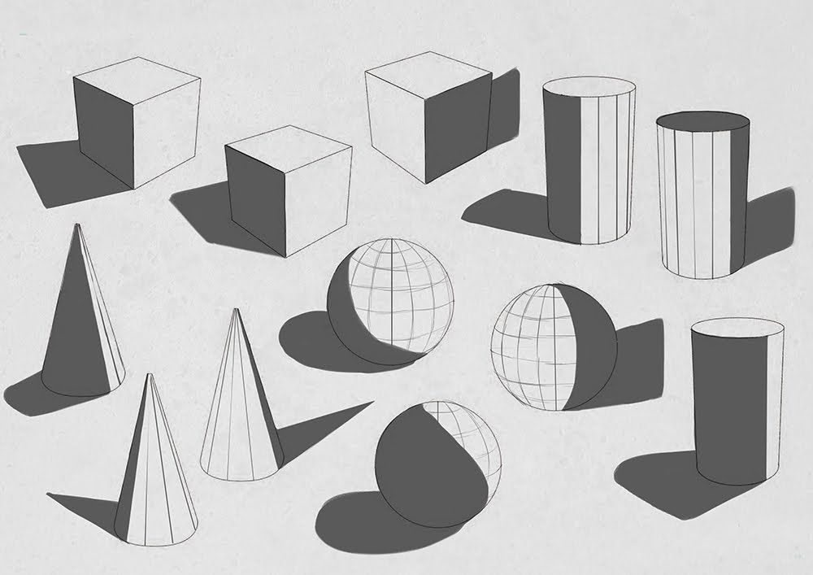
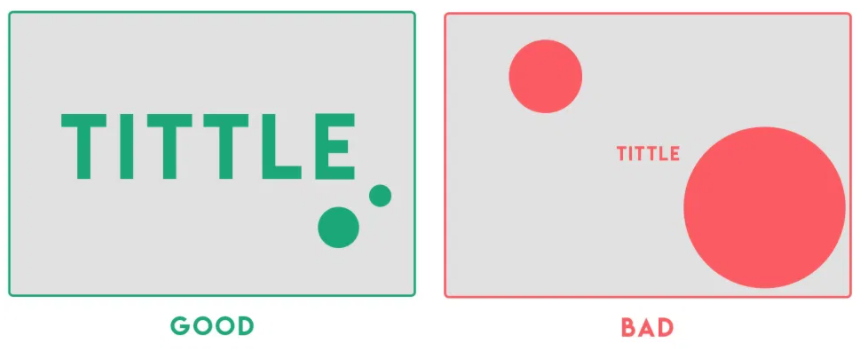
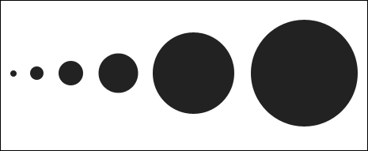

# Unit 2: Design UI and UX

## Visual communication
> Visual communication is the practice of using visual elements to convey a message, inspire change, or evoke emotion. {cite}`nediger_2020_how`

We will consider two aspects of Visual Communication:
- Visual Communication Principles
- Visual Communication Elements

You use elements of visual communication to achieve the principles of visual communication.  An analogy, if the principle is the cake you want to make, then the elements are the ingredients you use to make it.

### Visual Communication Elements
The elements of visual communication are the building block of UI design. By manipulating visual communication elements to implement the principles of visual communication you achieve the desired effect on the UI and, subsequently the UX. In other words, the elements of visual communication are the 'how' of what you want top achieve.

#### Space
Space is the area you have to work with. It includes space that is empty and space that contains text, images and other design features. Different uses of space can create clutter or it can create simplicity.

#### Line
Lines can direct the user to a focal point, divide different sections, form shapes and provide emphasis. They can be thick, thin, straight or wavy. They can create order or encourage creativity.

#### Colour
Colour can provide contrast or emphasis, unify a design, fill a shape or space and imply emotion. A colour scheme can be inspired by a logo or photograph. Colour theory defines rules that can be used to select aesthetically pleasing colour combinations.

#### Shape
Shapes can be natural, abstract or geometrical. They can be used to symbolically represent an action or create proximity by grouping similar elements.

#### Texture
Texture can be used to add interesting to a shape or space, attract attention or unify a design by linking it to the a real world idea with a similar texture.

#### Tone
Tone is the lightness or the darkness of a colour and can be contrasted to provide hierarchy, emphasis or separation of content.

#### Form
Form is the combination of other elements to create solid effects such as the use of tone and shape to create shadows, or the use of line, shape and colour to create a 3D perspective.

#### Proportion
Proportion relates to the size or quantity of elements in the design in comparison with other elements. Images with disproportionate height and width appear distorted. Unbalanced proportions are usually unattractive but can be used strategically to provide emphasis.

#### Scale
Scale refers to the size of an element. It can be used consistently to provide order and repetition to a design or contrasted to create a focal point or emphasis the importance of one element over another.

### Visual Communication Principles

#### Balance

#### Contrast

#### Proximity

#### Harmony

#### Alignment

#### Repetition

#### Hierarchy

