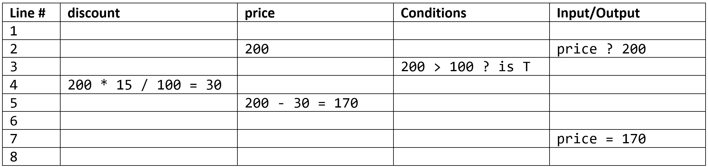

# Unit 1: Design Algorithms

Algorithms are the commands that make up our programs.

There are 6 basic building blocks that an algorithm consists of. Each of them serve a particular purpose.

- **Sequence:** a number of instructions that are processed one after the other.
- **Assignment:** used to store the value of an expression into a variable. 
- **Condition:** the way that a computer asks a question which can only generate two possible responses: True (yes) or False (no).
- **Selection:** a statement that uses a condition to select, or determine, whether the next line of the program is to be executed.
- **Iteration:** the repetition of a number of instructions. These are generally referred to as loops and refer to a section of code that is repeated. 
- **Modularisation:** refers to the process of breaking a large, unwieldy programming task into separate, smaller, more manageable subtasks or modules. Individual modules can then be cobbled together like building blocks to create a larger application.

In designing your algorithm, you will need to decide how to arrange these building block to achieve you outcome.

We will use a number of tools to do this:
- Activity Diagrams
- Class Diagrams
- Pseudocode
- IPO Tables
- Desk-checking

---
## Activity Diagrams
> Activity diagrams show the workflow from a start point to the finish point detailing the many decision paths that exist in the progression of events contained in the activity {cite}`sparxsystems_2022_activity`.

An activity diagram is made of of different components. Some of the most common components of an activity diagram include:
- **Action:** A step in the activity wherein the users or software perform a given task.
- **Decision node:** A conditional branch in the flow that includes a single input and two or more outputs.
- **Control flows:** Another name for the connectors that show the flow between steps in the diagram.
- **Start node:** Symbolizes the beginning of the activity.
- **End node:** Represents the final step in the activity.

Watch **[this video](https://www.youtube.com/watch?v=knM8BGY9yVI)** to understand how to create an activity diagram.

**Activity Diagram Symbols**


---
## Class Diagrams
> Class diagrams clearly map out the structure of a particular system by modelling its classes, attributes, operations, and relationships between objects {cite}`lucidchart_2017_uml`.

Class diagrams are particularly useful when using Object Orientated Programming.

The standard class diagram is composed of three sections:
- **Upper section:** Contains the name of the class. This section is always required.
- **Middle section:** Contains the attributes of the class. Use this section to describe the qualities of the class.
- **Bottom section:** Includes class operations (methods). Displayed in list format, each operation takes up its own line.

Watch **[this video](https://www.youtube.com/watch?v=UI6lqHOVHic)** to learn how to create class diagrams.

**Class Diagram Symbols**


## Pseudocode

Pseudocode is a technique used to describe the distinct steps of an algorithm in a manner that is easy to understand for anyone with basic programming knowledge.

Although pseudocode is a syntax-free description of an algorithm, it must provide a full description of the algorithm’s logic so that moving from it to implementation should be merely a task of translating each line into code using the syntax of any programming language.

Advantages of pseudocode:

- **Better readability** - Often, programmers work alongside people from other domains, such as mathematicians, business partners, managers, and so on. Using pseudocode to explain the mechanics of the code will make the communication between the different backgrounds easier and more efficient.
- **Ease up code construction** - When the programmer goes through the process of developing and generating pseudocode, the process of converting that into real code written in any programming language will become much easier and faster as well.
- **A good middle point between flowchart and code** - Moving directly from the idea to the flowchart to the code is not always a smooth ride. That’s where pseudocode presents a way to make the transition between the different stages somewhat smoother.
- **Act as a start point for documentation** - Documentation is an essential aspect of building a good project. Often, starting documentation is the most difficult part. However, pseudocode can represent a good starting point for what the documentation should include. Sometimes, programmers include the pseudocode as a docstring at the beginning of the code file.
- **Easier bug detection and fixing** - Since pseudocode is written in a human-readable format, it is easier to edit and discover bugs before actually writing a single line of code. Editing pseudocode can be done more efficiently than testing, debugging, and fixing actual code.

### QCAA Pseudocode Rules

In Digital Solutions, pseudocode has an additional purpose. The Digital Solutions Syllabus allows for a range of programming languages to be used. With different languages being used in schools across Queensland, pseudocode is used as the formal method of representing algorithms in Digital Solutions. In that capacity, QCAA has established very specific rules around for its use.

#### Keywords

**KEYWORDS** should be written bold and capitalized.

Keywords do not have to be valid programming language words as long as they clearly convey the intent of the line of pseudocode.

#### Calculations

Pseudocode should clearly indicate what is happening at each step, including formulas of calculations.

For example:
`CALCULATE net` is not as clear as `CALCULATE net = gross − tax`

#### Naming Conventions

Use snake case naming convention for variable names with multiple words, subroutines, methods and functions.

Snake case is a convention where all words are in lowercase and spaces between words is replaces with an `_`

For example:
`VAR file_name`

#### Font

Use a mono-space typeface when writing algorithms on computer:

Windows mono-space fonts:
- Courier New 
- Consolas
- Cascadia Code
- Cascadia Mono

Mac mono-spaced fonts:
- Andalé Mono
- Consolas
- Courier
- Courier New

#### Variables

To input or output values, common words can be used as keywords.

For example:
- `INPUT mark`
- `WRITE "the total is" count`
- `PRINT x, y`
- `DISPLAY name, result`
- `READ name from list.txt`
- `OUTPUT average`

Pseudocode uses the assignment operator, `=` to assign values.

For example:
- `CALCULATE net = gross - tax`

#### Modularisation

All pseudocode modules start and ends with the `BEGIN` and `END` keywords.

Main algorithm:
```
BEGIN
    statements
END
```

Defining procedures, subroutines, methods or functions
```
BEGIN function_name
    statements
END
```

Calling procedures, subroutines, methods or functions
```
statements
function_name
statements
```

#### Iterations

There are three main types of loops — each has a clear start and end, with the statements within the loop indented. 

**Post-test loops**
```
REPEAT
    statements
UNTIL
```
**Note:** Python does not have a Post-test loop, so we will not be using this.

**Pre-test loop**
```
WHILE
    statements
ENDWHILE
```

**Counted loop**
```
FOR count = start_val TO end_val
    statements
NEXT count
ENDFOR
```

#### Selection

A control structure used for decisions or branching and choosing alternate paths. The beginning and end of these structures are indicated with keywords.

**IF statement**
```
IF condition THEN
    statements
ENDIF
```

**IF...ELSE statement**
```
IF condition THEN
    statements
ELSE
    statements
ENDIF
```

**IF...ELIF...ELSE statement**
```
IF condition THEN
    statements
ELSE IF condition THEN
    statements
ELSE
    statements
ENDIF
```

**MATCH statement**
In most other languages these are called switches
```
SWITCH test_variable
    CASE option
        statements
    CASE option
        statements
    CASE statements
ENDSWITCH
```

## IPO Tables
Input Process Output (IPO) tables show sections of your algorithms. They are made up of three columns:
- **Inputs:** Lists all the information/actions this section needs.
- **Process:** Contains the pseudocode for this algorithm, following QCAA pseudocode rules
- **Output:** Lists all the information/actions that result from this section.


There is no need to represent all of your program in IPO tables, but rather you need to show the more complicated or tricky code. Each table should represent a section of code, with different functions (modules) being the obvious breaking point. 

Across all you IPO Tables you should have examples of all algorithm components:
- sequence
- assignment
- condition
- selection
- iteration
- modularisation

---
## Desk-checking

Desk checking is a manual (non computerised) technique for checking the logic of an algorithm. The person performing the desk check effectively acts as the computer, using pen and paper to record results. The desk checker carefully follows the algorithm being careful to rigidly adhere to the logic specified. The desk check can expose problems with the algorithm.

Desk checks are useful to check an algorithm (before coding) thereby confirming that the algorithm works as expected and saves time possibly writing a program that doesn't do what was intended. Another benefit of a desk check is that it confirms to the programmer/designer that the algorithm performs as intended.

A desk check is normally done as a table with columns for:

- Pseudo code line number - Pseudo code doesn't normally have lines numbers, but these are necessary in a desk check to specify the line(s) being executed
- One column per variable used. 
    - The columns should be in alphabetical order on variable name with the variable name at the top of the column. 
    - As the algorithm is executed, the new values of the variables are put in the appropriate column. 
    - Show working for calculations. 
    - If variable names consist of a number of words it is permissible to put a space between each word in the name so that the name fits better in the column by wrapping to the next line. e.g. the variable column heading discount Price could be used rather than the actual variable name discountPrice.
- condition column. 
    - The result of the condition will be true (T) or false (F). 
    - As the algorithm is executed, conditions are evaluated and the details are recorded in the column. 
    - Show working when evaluating the conditions. 
    - This is used whenever a condition is evaluated - IF WHILE or FOR statements all have explicit or implicit conditions.
- Input/Output
    - used to show what is input by the user and displayed by the program. 
    - Show inputs with: the variable name, a "?" and the value input e.g. price ? 200. 
    - Show outputs with the variable name, an =, and the value displayed (or just the value displayed) e.g. discountPrice= 180 .
    
### Branching Example

Consider the following pseudocode:

```
1 BEGIN calcPrice()
2    INPUT price
3    IF price > 100 THEN
4        discount = price * 15 / 100
5        price = price - discount
6    ENDIF
7    DISPLAY price
8 END
```

Since it has branching logic, you will need to run a test for each of the branches (in this case two).

Inputs: price = \$200  
Correct results: price = \$170


Inputs: price = \$50  
Correct results: price = \$50.


### Iteration Example

Consider the following pseudocode:

```
1 BEGIN calcSquares()
2    DISPLAY "X", "X Squared"
3    FOR x = 1 TO 3
4        xSquared = x * x
5        DISPLAY x, xSquared
6    NEXT x
7    ENDFOR
8    DISPLAY "-----------"
9 END
```

