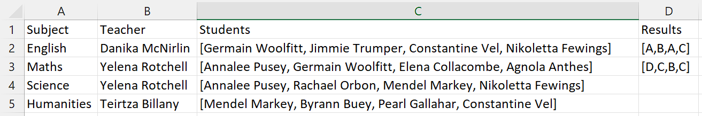

# Unit 2: Develop Algorithms

For unit 2 we are concerned about the development of algorithms for the management of the data store. This process will have to occur after the development of the datastore.

Specifically we will need to create IPO tables for:
- Creating the database
- Processing data for insertion
- Retrieval of data
- Manipulation of data

## Creating database structure
You will need a algorithm to create each table of the database expressed in an IPO table.

The pseudocode for creating a table need to include the following details:
- Table name
- For each field
  - Name
  - Data type
- Indicate:
  - Primary key
  - Foreign key (including which primary key it references)

```
CREATE TABLE Teacher
    TeacherID INT PK
    Name TEXT
    Username TEXT
    Password TEXT

CREATE TABLE Subject
    SubjectID INT PK
    Name TEXT
    TeacherID INT FK Teacher.TeacherID

CREATE TABLE Student
    Student INT PK
    Name TEXT
    Username TEXT
    Password TEXT

CREATE TABLE Enrolment
    SubjectID INT PK FK Subject.SubjectID
    Student INT PK FK Student.StudentID
    RESULT TEXT
```

## Processes data for insertion
There are two steps in processing your data for insertion.
- Cleaning the data
- Inserting the data into your database

### Cleaning the data
> Data cleaning is the process of ensuring that your data is correct, consistent and usable.{cite}`gimenez_2020_6`

To clean the data you need to have a close look at the data you have been provided, and identify possible problems with the data. To fix the data manually is not feasible, once the dataset becomes sufficiently large, so you will need to work out an algorithm, which identifies problems and then corrects the data ready for insertion into the database.

Possible errors include:
- unnecessary leading or trailing spaces
- duplicate entries
- incorrect capitalisation
- inconsistent values (eg. NA, n/a, not applicable)
- missing data
- formatting of values (eg date format)
- merging or splitting values (eg. name column split into FirstName and LastName)

Your cleaning algorithm will depend on the errors you identify and it is recommended that it is written as a separate function, as it will be called for each line of data that you need to insert

```
BEGIN clean_data (data)

clean_data = []

id = data[0]
first_name = data[1] STRIPSPACE CAPITALISE
last_name = data[2] STRIPSPACE CAPITALISE
name = first_name + last_name
dob = data[3] REPLACE "-" WITH "/"

RETURN [id, name, dob]

END
```

### Inserting data into
Once the data has been cleaned, it need to be inserted into your database. This can get quite tricky, as Unit 2 data will be provided in a flat file database, and you will need to parse it into a relational database. Why is this tricky? Well each row of the flat file data source may contain multiple database tables, or a single database table my be provided over several rows in the flat file data source.

Your application will read the source data one row at a time, and you will need to assemble the insertion data into the appropriate tables for your database. How this insertion data is assembled will differ depending on each data source.

For example, consider the data in this flat file data source:


Your pseudocode would have to address the following issues:
- the data contained in the data source will need to be written to four different database tables
- there is duplicate data
  - teacher names
  - student names
- the student column contains a list and each item needs to be processed separately
- the results column also contains a list which requires you to assume that the results correspond with the names from the student column

Your pseudocode could look something like this:

```
BEGIN insert_data(row)

IF row[0] NOT IN Subject
  INSERT row[0] INTO Subject
ENDIF

IF row[1] NOT IN Teacher
  INSERT row[1] INTO Teacher
ENDIF

FOR index = 0 to LEN(row[2])
  IF row[2][index] NOT IN Student
    INSERT row[2][index] IN Student
  ENDIF

  INSERT row[0], row[2][index], row[3][index] INTO Enrolment
NEXT FOR
ENDFOR

END 
```

## Retrieving data
In designing algorithms for data retrieval you need to identify
- The fields being retrieved
- Any filtering involved


## Manipulating data 
Manipulating data involves

