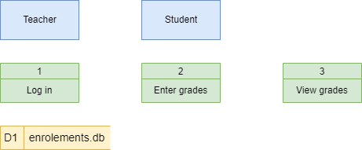
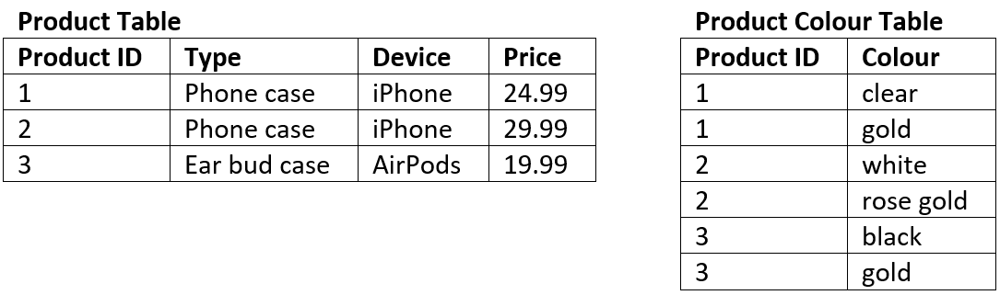
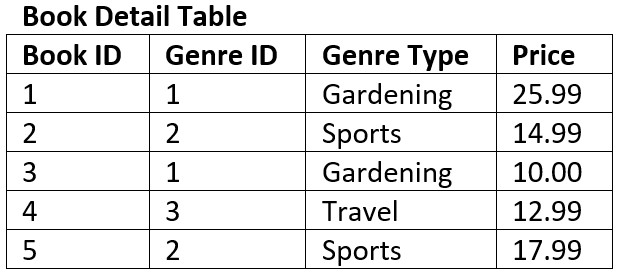

# Unit 2: Develop Data Store

## Scenario

The first step in designing a database is developing an understanding of the scenario. For learning about designing databases we will use the following example:

### Student Subject Database

- Students can log into to access:
  - their current enrolment
  - subject grades when entered
- Teachers can log into to:
  - Enter student grades
- Each subject is only offered once, with one teacher
- Each student can enrol in each subject only once.

## Data Flow Diagram
>
> A data flow diagram (DFD) maps out the flow of information for any process or system. It uses defined symbols like rectangles, circles and arrows, plus short text labels, to show data inputs, outputs, storage points and the routes between each destination. {cite}`lucidchart_2017_what`

The Data Flow Diagram is made up from four components:

- external entities
- process
- data stores
- data flows

We will use the following symbols to represent the components of DFD

### Steps for creating a DFD

#### Step 1: Identify the External Entities

External entities are:

- an outside system that sends or receives data, communicating with the system being diagrammed
- the sources and destinations of information entering or leaving the system
- may be an outside organization or person, a computer system or a business system
- should be labelled using a noun.

To design your DFD, consider the scenario you are addressing. What are the external sources and the destinations of data? That is, from outside of the application you are developing, who or what provides data or receives data?

Data can be provided in various ways:

- user typing into an interface
- user clicking on a button
- another system providing a file
- sensor readings

Data can be received in various ways:

- displayed on a screen
- printed to paper
- sent a file
- lights and metre readings

When considering the **Student Subject Database** all data is sourced from and destined for two external entities:

#### Step 2: Identify Processes

Processes are:

- any process that changes the data, producing an output
- may perform computations, or sort data based on logic, or direct the data flow based on business rules
- a short label is used to describe the process, such as “Submit payment”, and should be a verb or verb phrase

Once again consider the scenario you are designing a database for. What things within the systems do some kind of work on the data passing through it. Referring back to your Use Case Diagram, can help in identifying these.

In our **Student Subject Database** there are three processes can occur:

#### Step 3: Identify Data Stores

Data stores are

- files or repositories that hold information for later use, such as a database table or a membership form
- each data store receives a simple label, such as “Orders”, along with a designation (D: digital, M: manual, T: temporary)

To identify your data stores, look for groupings of associated information. In our course we will generally have one datastore, unless the prescribed requirements indicate otherwise.

We only have one data store (a digital one) in our **Student Subject Database** example

#### Step 4: Identify Data Flows

Data flows represent:

- the route that data takes between the external entities, processes and data stores
- portrays the interface between the other components and is shown with arrows
- typically labelled with a short data name, like “Billing details”, which is a noun.

Important rules when adding data flows:

- each process should have at least one data flow in and at least one data flow out
- every data flow must connect to at least one process
- each entity should have at least one data flow to or from a process

Here is the **Student Subject Database** example with all data flows added

#### Step 5: Decompose to next level

To keep DFDs to a manageable size, each process can be decomposed into more detail.

The top level DFD is called **Level 0** and should only involve around seven processes. If you have more than seven, then you need to combine processes that logically fit together.

Once the Level 0 DFD is created identify any processes that require more detail. Each of these processes are then decomposed into another DFD. The first deposition is called **Level 1** and subsequent decompositions, Level 2, Level 3 etc.

The processes in the subsequent decompositions inherent their numbering from their parent process.

We will decompose the Log in process in the **Student Subject Database** example.

### Record in project

All levels of your final DFD will be included in your project documentation.

---

## Data needs and requirements

In assessing the data needs and requirements you need to list all the data that needs to be stored in the database. Most of these have already been identified in the Explore phase and are present in the mind map.

This list will inform the design of your Entity Relationship Diagram. There is no need to record it in your project documentation.

For our **Student Subject Database** example:

- Teacher name
- Teacher username
- Teacher password
- Student name
- Student username
- Student password
- Subject name
- Subject result

## Entity Relationship Diagram
>
> An Entity Relationship Diagram (ERD) is a type of flowchart that illustrates how “entities” such as people, objects or concepts relate to each other within a system. {cite}`lucidchart_2017_er`

Watch the videos below to understand designing an ERD.

<iframe width="560" height="315" src="https://www.youtube.com/embed/QpdhBUYk7Kk" title="YouTube video player" frameborder="0" allow="accelerometer; autoplay; clipboard-write; encrypted-media; gyroscope; picture-in-picture" allowfullscreen></iframe>

<iframe width="560" height="315" src="https://www.youtube.com/embed/-CuY5ADwn24" title="YouTube video player" frameborder="0" allow="accelerometer; autoplay; clipboard-write; encrypted-media; gyroscope; picture-in-picture" allowfullscreen></iframe>

We will use the following steps to create our Entity Relationship Diagrams, using the **Student Subject Database** as an example:

### Step 1: Identify the entities

Look at the scenario and the data needs and identify all the entities that the database needs to store. Entities can be people, places, things or processes.

In the **Student Subject Database** we have the following entities.

### Step 2: Add attributes

Refer back to your data needs and requirements and add the relevant attributes to each entity.

The **Student Subject Database** ERD after stage 2:

### Step 3: Establish relationships and cardinality

The next step is to create the connection between the entities. First connect the related entities using lines. Then establish the cardinality by working out the range of connections each entity can have to the second entity.

For example in the **Student Subject Database**:

- teacher subject relationship
  - each teacher can teach zero to many subjects (assuming you can have teachers who do not teach for this time period)
  - each subject has one and only one teacher who teaches it
- student subject relationship
  - each student can study zero to many subject (assuming a student can be enrolled but not studying)
  - each subject can have zero to many students studying it (assuming a subject can exist without students studying it)

You will end up with the following ERD

### Step 4: Resolve many-to-many relationships

In this course we will use bridging entities to deal with many-to-many relationships.

To do this:

- find a many-to-many relationship
- place a bridging entity between the two
  - the bridging entity will have a composite key, so use the correct table
- reconnect the relationships
- establish the new cardinality
  - the cardinality will be a many on the bridging entity's side, and a one on the original entities' sides
- enter the primary keys from the original entities as the two parts of the composite key for the bridging entity
- add any other relevant attributes

For our **Student Subject Database**:

- the subject / student relationship is a many-to-many
- add a bridging entity between the two, and named 'Enrolments'
  - if you can't think of an appropriate name, just combine the name of the two original entities
- connect the relationships from the Enrolments entity to the Subject entity and the Student entities
- the new cardinalities will be many on the Enrolments entity end, and one on both the Subject entity and the Student entity
- SubjectID and StudentID are entered as the two parts of Enrolments' composite key
- the attribute of Results is added to Enrolments

At the end of step 4 our ERD looks like this:

### Step 5: Identify the foreign keys

Identifying the foreign keys establishes how the different entities are connected together. If there is a relationship drawn between entities, then there must be a primary key / foreign key connection.

Steps to establish foreign keys

- choose a relationship
- check the table on the many end for an attribute that naturally connects to the other entity
  - ensure that the name of the foreign key reflects the primary key.
  - if you can't find one, you should add an attribute and name it after the primary key of the other entity
- place a FK in front of the foreign key attribute
- move the relationship so that it connects the foreign key to it respective primary key

Our **Student Subject Database** example at the end of step 5:

## Sample Tables

Sample tables are used to ensure that the database structure that the ERD produced can effectively store the required data adequately.

You should create tables that reflects the entities identified and attributes identified by the ERD. Then fill the table with sample data. This data may be given to you, or you may produce mock data that is representative of data that will be stored in the database. A good resource for creating mock data is **<a href="https://www.mockaroo.com/" target="_blank">mockaroo</a>**.

Below are the sample tables for the **Student Subject Database**.

## Normalisation
>
> Normalization is a database design technique that reduces data redundancy and eliminates undesirable characteristics like Insertion, Update and Deletion Anomalies. Normalization rules divides larger tables into smaller tables and links them using relationships. The purpose of Normalisation ... is to eliminate redundant (repetitive) data and ensure data is stored logically. {cite}`richardpeterson_2019_what`

Data redundancy is undesirable because it results in:

- Increased database size
- Erosion of data integrity through:
  - **Insertion anomalies**
    - the need to repeat data when entering new values
  - **Deletion anomalies**
    - the loss of a related dataset when some other dataset is deleted
  - **Causes update anomalies**
    - the same entity can have conflicting values after an incorrect update

To understand the process of normalisation, watch the following videos.

<iframe width="560" height="315" src="https://www.youtube.com/embed/xoTyrdT9SZI" title="YouTube video player" frameborder="0" allow="accelerometer; autoplay; clipboard-write; encrypted-media; gyroscope; picture-in-picture" allowfullscreen></iframe>

<iframe width="560" height="315" src="https://www.youtube.com/embed/mUtAPbb1ECM" title="YouTube video player" frameborder="0" allow="accelerometer; autoplay; clipboard-write; encrypted-media; gyroscope; picture-in-picture" allowfullscreen></iframe>

<iframe width="560" height="315" src="https://www.youtube.com/embed/R7UblSu4744" title="YouTube video player" frameborder="0" allow="accelerometer; autoplay; clipboard-write; encrypted-media; gyroscope; picture-in-picture" allowfullscreen></iframe>

<iframe width="560" height="315" src="https://www.youtube.com/embed/aAx_JoEDXQA" title="YouTube video player" frameborder="0" allow="accelerometer; autoplay; clipboard-write; encrypted-media; gyroscope; picture-in-picture" allowfullscreen></iframe>

### Normalisation checking

If your ERD was successful your database should already be in 3rd Normal Form. Using your sample tables ensure that each table meets the requirements for 1st, 2nd and 3rd Normal Form. If you find that your table is not in 3NF you may need to adjust your ERD.

#### 1st Normal Form (1NF)

- Each column should contain atomic values
- Each column should contain the same type of data
- Each column should have a unique name
- The order in which the data is saved does not matter

##### For example: the table below is not in 1NF

- There are two columns with the name of Details
- The first Details column stores information about the type of product **and** the type of device
- The second Details column values are not atomic (each record has multiple colours stored)

The tables below represent the same data in 1NF.

#### 2nd Normal Form (2NF)

- It is in 1NF
- There are no **partial dependencies:**
  - where an attribute is only dependant upon part of a composite key (this can only happen when you have a composite key).

##### For example: the table below is not in 2NF

- The composite key is *Customer ID* and *Store ID*.
- *Date* is dependent on both the *Customer ID* and the *Store ID*.
- *Location* is only dependent on the *Store ID* it has no connection to *Customer ID* at all, therefore it is a partial dependency.

The tables below represent the same data in 2NF

#### 3rd Normal Form (3NF)

- Is at 2NF
- There are no **transitive dependencies:**
  - where an attribute is dependant on an attribute other than the primary key.

##### For example: the table below is not in 3NF

- The key of the table is *Book ID*
- The field *Genre Type* is dependent on the non-key field of *Genre ID* therefore it is a transitive dependency.

The tables below represent the same data in 3NF

## Data dictionaries

A data dictionary is a reference guide that lists information about the data in a database or system, such as its name, type, and rules for use. It helps ensure accurate and consistent use of the data.

The following video explains data dictionaries

<iframe width="560" height="315" src="https://www.youtube-nocookie.com/embed/aOVN0v-HWcQ" title="YouTube video player" frameborder="0" allow="accelerometer; autoplay; clipboard-write; encrypted-media; gyroscope; picture-in-picture; web-share" allowfullscreen></iframe>

Your data dictionaries should include the following details:

- Name of Field: make sure you follow you naming conventions
- Definition of the Field: these details should naturally flow from the ERD
- Data type: in SQLite we have Text, Integer, Real, and Blob
- Possible values: taken from sample data
- <a href="https://www.tutorialspoint.com/sqlite/sqlite_constraints.htm" target="_blank">Validation rules</a>: 
  - NOT NULL - Ensures that a column cannot have NULL value
  - DEFAULT Constraint − Provides a default value for a column when none is specified
  - UNIQUE Constraint − Ensures that all values in a column are different
  - PRIMARY Key − Uniquely identifies each row/record in a database table
  - CHECK Constraint − Ensures that all values in a column satisfies certain conditions.
- Formatting: data can either be stored formatted or can be formatted once retrieved.

Below is an example of a data dictionary. Note that you should create a data dictionary for each table is your database.

## Relational Schema

To convert your final, adjusted ERD to a Relational Schema (RS) you will need to identify the datatype of each field.

We will be using SQLite which provides the following data type options:

- INTEGER: signed integers
- REAL: floating point values
- TEXT: text strings
- BLOB: a blob of data, stored exactly as it was input

Since Diagram.net does not provide a three column entity table, we will separate the attribute name and data type using the `|` symbol.

The RS for the **Student Subject Database** will look like:

