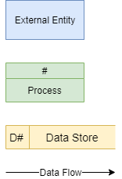

# Unit 2: Design Data Source

## Scenario
The first step in designing a database is developing an understanding of the scenario. For learning about designing databases we will use the following example:

**Student Subject Database**
- Students can log into to access:
  - their current enrolment
  - subject grades when entered
- Teachers can log into to:
  - Enter student grades
- Each subject is only offered once, with one teacher
- Each student can enrol in each subject only once.

## Data Flow Diagram
> A data flow diagram (DFD) maps out the flow of information for any process or system. It uses defined symbols like rectangles, circles and arrows, plus short text labels, to show data inputs, outputs, storage points and the routes between each destination. {cite}`lucidchart_2017_what`

The Data Flow Diagram is made up from four components:
- **External entity:** 
  - an outside system that sends or receives data, communicating with the system being diagrammed
  - the sources and destinations of information entering or leaving the system 
  - may be an outside organization or person, a computer system or a business system
- **Process:**
  - any process that changes the data, producing an output
  - may perform computations, or sort data based on logic, or direct the data flow based on business rules
  - a short label is used to describe the process, such as “Submit payment”
- **Data Store:**
  - files or repositories that hold information for later use, such as a database table or a membership form
  - each data store receives a simple label, such as “Orders”
- **Data flow:** 
  - the route that data takes between the external entities, processes and data stores
  - portrays the interface between the other components and is shown with arrows
  - typically labelled with a short data name, like “Billing details”

We will use the following symbols to represent the components of DFD

### Steps for creating a DFD

**Step 1: Identify the External Entities**

## Data needs and requirements

## Entity Relationship Diagram

## Sample Tables

## Normalisation

## Relational Schema

## Data Dictionary

