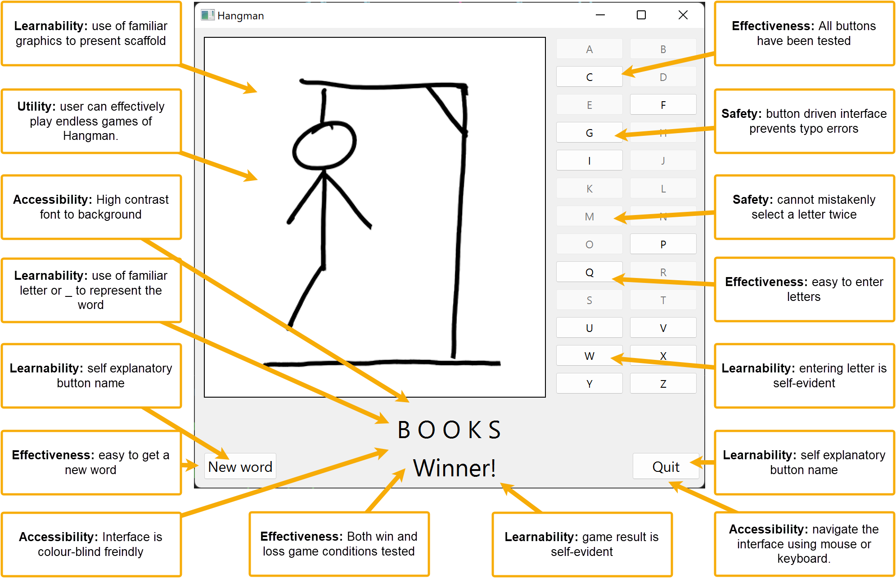
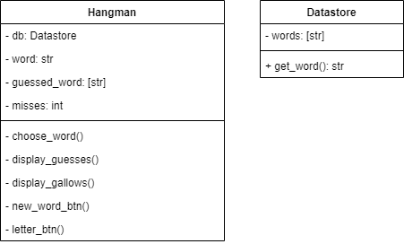
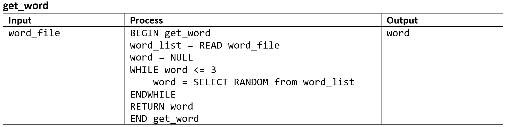
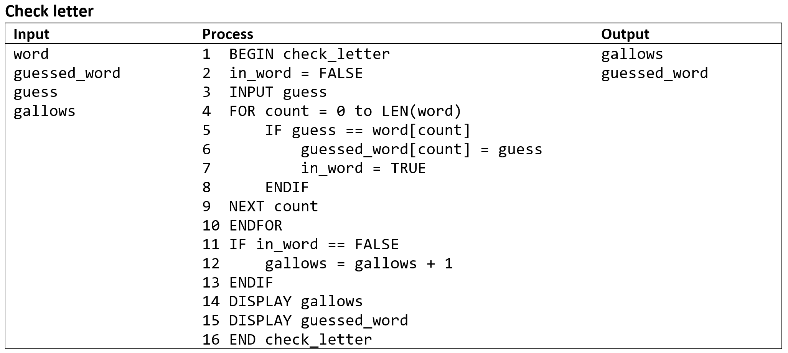
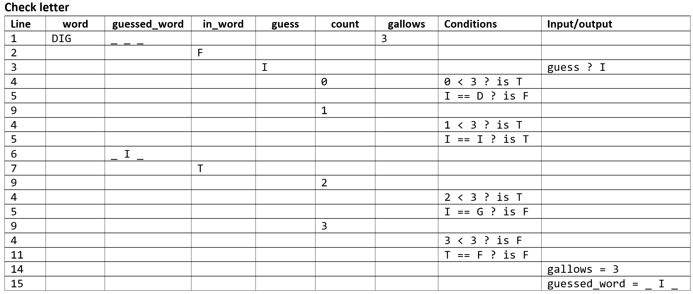

# Unit 1 Scenario: Develop Phase

## Mockup

## Class Diagram

## IPO Tables

When deciding which IPOs to show in your document, make sure that you cover the basics:

- Sequence
- Selection
- Iteration
- Modularisation
- Input
- Assignment

Also show the IPO tables for any especially tricky algorithms.

## Desk-checking

This is only one desk check. You should desk check your more complicated algorithms.

