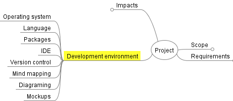

# Select Development Environment

```{admonition} Tools used:
:class: attention 
- Mind Map
```
## For Units 1 to 4
Our development environment will consist of:
- **Operating System:** Windows or macOS
- **Language:** Python
- **Packages:** PyQt6
- **IDE:** Visual Studio Code
- **Version Control:**
  - Git
  - GitHub
  - GitHub Desktop
- **Mind Mapping:** FreeMind
- **Diagramming:** Diagrams dot net
- **Mockups**:
  - Adobe XD or
  - QT Designer

These should be recorded in your Mind map:  


```{admonition} Unit 1 subject matter covered:
- explore programming development tools to understand how to use them effectively
{cite}`queenslandcurriculumassessmentauthority_2017_digital`
```

```{admonition} Unit 3 subject matter covered:
- explore flexible development methods to support a variety of user profiles
{cite}`queenslandcurriculumassessmentauthority_2017_digital`
```

```{admonition} Unit 4 subject matter covered:
- use a suitable programming environment to receive data from an external source, and process and display the data in an appropriate format
- use a suitable programming environment to incorporate existing code libraries (where applicable)
{cite}`queenslandcurriculumassessmentauthority_2017_digital`
```