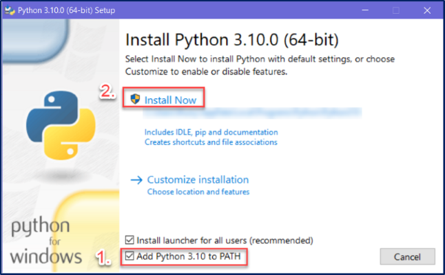

# Unit 1: Select Development Environment

## Programming Language

We will be using **Python** as our programming language for this course. Specifically we will be using Python 3.10 or later

To install Python go to the [downloads section of the Python website](https://www.python.org/downloads/) and choose the installer for your OS.

```{warning} **Really important for Windows users:**  
You need to make sure that you check the box beside **Add Python 3.XX to PATH** (see below).  
Failure to do this will hamper the use of Python on Windows, and, when you have a problem, I will tell you to reinstall Python using the instruction that you should have used the first time.
```



### Packages

Python comes installed with a range of packages. This is called [The Python Standard Library](https://docs.python.org/3/library/). Although these might seem like a huge number of packages, it is actually a very small selection of packages available. These cover Python's basic operations, and limiting the install to these packages reduces the size of Python. 

To extend the functionality of Python, you need to install additional packages. These packages can be found at the [Python Package Index](https://pypi.org/). Some of the packages we will use are:

- [PyQt6](https://pypi.org/)

To install the packages, we will be using Python's built-in package installer `pip`.

### Virtual Environments

The modular nature of Python means that different projects will require different packages. Over time your Python install will become bloated. To prevent this we use **virtual environments**.

At its core, the main purpose of Python virtual environments is to create an isolated environment for each Python project. This means that each project can have its own packages, regardless of what packages every other project has. The great thing about this is that there are no limits to the number of environments you can have, since they're just directories containing a few scripts. 

---
## Integrated Development Environment

Since Python script files are just text files, you can write Python code in Windows *Notepad*, or *TextEdit* on macOS, and this might work for small projects. Once your project starts involving several modules, each with hundreds of lines, it becoming unwieldy. This is where IDEs (Integrated Development Environment) and Code Editors come in.

An **IDE (or Integrated Development Environment)** is a program dedicated to software development. As the name implies, IDEs integrate several tools specifically designed for software development. These tools usually include:
- An editor designed to handle code (with, for example, syntax highlighting and auto-completion)
- Build, execution, and debugging tools
- Some form of source control

In contrast, a dedicated **code editor** can be as simple as a text editor with syntax highlighting and code formatting capabilities. Most good code editors can execute code and control a debugger. The very best ones interact with source control systems as well. Compared to an IDE, a good dedicated code editor is usually smaller and quicker, but often less feature rich.

We will be using **Visual Studio Code (VS Code)** ([download from here](https://code.visualstudio.com/)) which is a code editor, although, we will use a range extensions to expand its capability so that is it almost and IDE.

Importantly, the extended VS Code will allows us to:
- **Save and reload code files** - allows you to save your work and reopen everything later, in the same state it was in when you left.
- **Run code from within the environment** - you can run Python code without having to drop out of the editor.
- **Debugging support** - allow you to step through your code as it runs, displaying variable values etc.
- **Syntax highlighting** - uses font colours to help you quickly spot keywords, variables, and symbols in your code. This makes reading and understanding code much easier.
- **Automatic code formatting** - little things like recognizing the colon at the end of a while or for statement, and indenting the next line, makes life easier.

### Extensions 

We will be using the below extensions in VS Code to expand it's capabilities:

- [Python](https://marketplace.visualstudio.com/items?itemName=ms-python.python)
- [Pylance](https://marketplace.visualstudio.com/items?itemName=ms-python.vscode-pylance)
- [Visual Studio IntelliCode](https://marketplace.visualstudio.com/items?itemName=VisualStudioExptTeam.vscodeintellicode)
- [Qt for Python](https://marketplace.visualstudio.com/items?itemName=seanwu.vscode-qt-for-python)
- [SQLite](https://marketplace.visualstudio.com/items?itemName=alexcvzz.vscode-sqlite)
- [Rainbow CSV](https://marketplace.visualstudio.com/items?itemName=mechatroner.rainbow-csv)

You can also install various icon and colour themes. For this course I will be using the extensions below, but you can use whatever you like.

- [Neon Vommit Color Theme](https://marketplace.visualstudio.com/items?itemName=ghgofort.neon-vommit)
- [Material Icon Theme](https://marketplace.visualstudio.com/items?itemName=PKief.material-icon-theme)

---
## Version Control

Version control, also known as source control, is the practice of tracking and managing changes to software code. Version control systems are software tools that help software teams manage changes to source code over time.

### Git

Git is a free and open source distributed version control system designed to handle everything from small to very large projects with speed and efficiency. Git is naturally incorporated into VS Code, but you will need to [download and install the Git client](https://git-scm.com/downloads) for it to work properly.

### Github

[GitHub](https://github.com/) is a provider of Internet hosting for software development and version control using Git. It offers the distributed version control and source code management (SCM) functionality of Git, plus its own features. It provides access control and several collaboration features such as bug tracking, feature requests, task management, continuous integration and wikis for every project. It is commonly used to host open-source projects. As of November 2021, GitHub reports having over 73 million developers and more than 200 million repositories (including at least 28 million public repositories).

We will be using GitHub to host your code for this course. If you don't already have an account, got to [GitHub](https://github.com/) and register. Use your personal email to register, as this is a tool you should be using after school, and you may wish to access the code you make during this course.

To make working with GitHub easier, we will also be using [GitHub Desktop](https://desktop.github.com/) which is a GUI interface for working with GitHub. It makes using GitHub significantly easier.

---
## Other Tools
### FreeMind

An important step in analysing and planning in Digital Solutions is using mind maps. There are many mind mapping tools available, both desktop and online, but I recommend that we use [FreeMind](https://sourceforge.net/projects/freemind/). It's open source, has all the features we need and it's desktop nature means it's always available. 

### Diagrams dot net

Throughout the course you will need to create a range of diagrams. To do this we will use diagrams.net. You can use the [online version](https://www.diagrams.net/), or you can download the [desktop version](http://get.diagrams.net/). I personally use the desktop version to save my diagrams strait to my project folders.

### Adobe XD

We will be using Adobe XD to create wireframes, mockups, prototypes, and application interface flowcharts for FIA1. To install Adobe XD you need to [download and install Creative Cloud](https://creativecloud.adobe.com/en/apps/download/creative-cloud), log in using your school account and then choose to install Adobe XD.

### Qt Designer

[Qt Designer](https://build-system.fman.io/qt-designer-download) is a tool for quickly building graphical user interfaces with widgets from the Qt GUI framework. It gives you a simple drag-and-drop interface for laying out components such as buttons, text fields, combo boxes and more. We will be using it throughout the course do design our interface and provide mockups for FIA2.