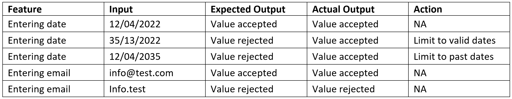
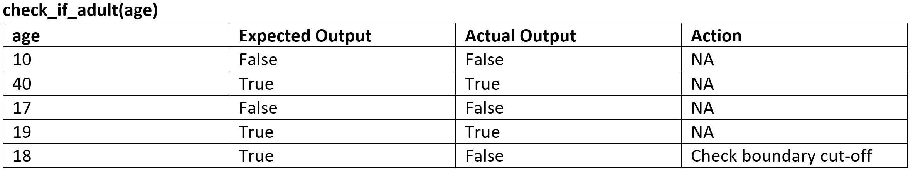

# Unit 1: Test Code

Testing your code is something that starts during algorithm design and will continue right up until the completion of your project. We have already covered desk checking in the development phase. In this section we will look at the testing needed whilst you generate your code.

## Testing
There are three types of testing which occur during code generation:
- **exploratory testing:** a form of testing that is done without a plan. In an exploratory test, you're just exploring the application. For example, checking and experimenting with the features when you run your application for the first time? 
- **integrated testing:** testing multiple components at the same time.
- **unit testing** testing that single components operate in the right way.

A major challenge with integrated testing is when an integrated test doesn't give the right result. It's very hard to diagnose the issue without being able to isolate which part of the system is failing. Unit tests help you to isolate what is broken in your application and fix it faster.

### Integrated testing
Integrated testing is used throughout an application's life-time, covering many development cycles. Since our projects only deal with a single development cycle, you will only use integrated testing at the end of your project.

To undertake integrated testing, you need to:
1. make a list of all the features your application has, including the different types of input it can accept, and the expected results. 
2. run integrated tests for each feature using correct inputs and check that results match the expected results.
3. run integrated tests for each feature using *erroneous* inputs and check that errors are caught or prevented.

It is best to record this information in a table with the following columns:
- **Feature:** the feature you are testing (this will repeated for this test)
- **Input:** the input entered by the tester
- **Expected Output:** the output expected if the feature is working correctly
- **Actual Output:** the output obtain by running the test
- **Action:** what steps, if any, need to be taken to resolve the problem.

For example:  

### Unit testing
In Digital Solutions we will use unit testing in three capacities:
- Throughout the generation phase, when a distinct unit (eg. function, class, or method) is completed.
- Throughout the generation when the code in a previously tested unit is changed.
- When the integrated tests fail unit testing is used to identify where the problems are.

To run unit tests:
1. create a testing script that imports possible erroneous units (functions and methods) from the program.
2. for each unit create a list of the acceptable inputs and expected outputs.
3. run unit tests to ensure that asserts if each unit provides the correct output for each given input.
4. when a incorrect out is received, then debug the specific unit until you get the correct output.

Record your testing in a table like this:

### Debugging
In computer programming and software development, debugging is the process of finding and resolving bugs (defects or problems that prevent correct operation) within computer programs, software, or systems. Many programming languages and software development tools also offer programs to aid in debugging, known as debuggers.

---
## Error Correction
Dealing with errors is an integral part of any development process, to the point where seasoned coders eventually become experts at navigating and fixing the errors they create. 

When developing programs there are three types of error that can occur.
### Syntax errors
Syntax errors occur when the code given does not follow the syntax rules of the programming language. A program cannot run if it has syntax errors. Any such errors must be fixed first. A good integrated development environment (IDE) usually points out any syntax errors to the programmer.

Examples include:
 - misspelling a statement, eg. writing pint instead of print
 - using a variable before it has been declared
 - missing brackets, eg. opening a bracket, but not closing it

### Logic errors
A logic errors is an error in the way a program works. The program can run but does not do what it is expected to do. Unlike a syntax error, a logic error does not usually stop a program from running. The program will run, but not function as expected. 

Logic errors can be caused by the programmer:
    - incorrectly using logical operators, eg. expecting a program to stop when the value of a variable reaches `5`, but you use `< 5` instead of `<= 5`
    - incorrectly using Boolean operators
    - unintentionally creating a situation where an infinite loop may occur
    - incorrectly using brackets in calculations
    - unintentionally using the same variable name at different points in the program for different purposes
    - using incorrect program design

### Runtime errors
A runtime errors is an error that takes place during the running of a program. For example, writing a program that tries to access the sixth item in a list that only contains five items. A runtime error is likely to crash the program.
