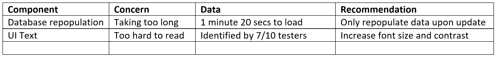

# Unit 1: Evaluate Components

Evaluating components occurs throughout the generation phase. It occurs anytime you change a component of your solution to improve it. 
For example, the database is taking too long to build and populate, so, instead of doing this each time the program is launched, you decide to build and populate the database once and then repopulate when there is an update.

Component evaluation also happens towards to end of the Generate phase when you have other users test your solution and give you feedback. For example, your testers indicate that the text is too hard to read, you recommend to increase the size and contrast of all text. 

Although this important design skill is demonstrates critical thinking, it is frequently hidden from assessor. Therefore we will use the Evaluate Components table to keep a track of these decisions as they occur. 

For example  

---
## Evaluating User Interface
One of the components that require evaluation is UI. This presents a unique problem. Developers should not evaluated their UI design. Why? 
Watch the video below to find out.

<iframe width="560" height="315" src="https://www.youtube.com/embed/baY3SaIhfl0" title="YouTube video player" frameborder="0" allow="accelerometer; autoplay; clipboard-write; encrypted-media; gyroscope; picture-in-picture" allowfullscreen></iframe>

{cite}`mackey_2021_devs`

The problem with developers evaluating their UI design is that (as the video shows) developers already know how the application is meant to be used. 

You need other people to evaluate your UI and give you feedback. You will need to plan the collection of this feedback to ensure useful data for your evaluation.

### Planning UI Feedback Collection

#### Establish your feedback criteria
You want useful, specific measurable feedback that you can use to evaluate your UI. To do this you need to have clear criteria to assess. Fortunately, in the exploration phase of the EDGE Process, you have establish prescribed criteria and self-determined criteria.

To establish your feedback criteria:  
1. identify the prescribed criteria, and self determined criteria that address either the UI or Useability Principles
2. list these criteria, along with their respective measurements of success.
3. establish tasks that the user can do to test each criteria.

Now that you have the tasks established to test the relevant prescribed and self determined criteria, you will need a way to collect the testers' feedback. For this you will use a survey. 

#### Establishing the survey questions types
You will use Microsoft Forms to survey your testers. Microsoft Forms has has a number of different question, each with the specific uses. They are laid out in the table below.

|Question type|Description|Considerations|Use Examples|
|:---|:---|:---|:---|
|Text (short answer)|A single-line box in which testers can type responses|Good when the range of answers is not known, but requires manual summary|Name, email|
|Text (long answer)|A multiple-line box in which testers can type responses|Good when the range of answers is not known, but requires manual summary|Additional comments|
|Choice|A list of multiple options from which the user selects one response|Good when the range of answers is know and has automatic tallying of response frequency|Age range, Education level|
|Rating|Users can provide a weighted response on a range of values|Allows the user to record their strength of opinion and has automatic averaging of results|How easy was the program to use?|
|Ranking|Allows testers to arrange responses in order of preference|Allows user to show preference, but cannot be automatically summarised|Order the features from most desirable to least desirable|
|Likert|Like a series of ratings on the same scale|Easy to fill out, but has no automatic summary features|Rate the UI features on their ease of use|

Of these question type options, you will mostly use Text, Choice and Rating questions.

Considered the criteria that you will have your testers evaluate, and choose the best type of question for each criteria.

#### Write your survey questions
To write your survey questions we need to decode (translate) each criteria you are evaluating. The prescribed criteria and the self-determined criteria are written for a developer audience, therefore the language used is very technical. Asking the user about the use of proximity, or to rate the safety of the application doesn't make sense to a non-developer. 

You will need to look at each criteria and ask yourself:
- what does that look like from the user's experience
- what can I ask about that experience

For example. Instead of asking about the Visual Communication Principle of proximity, you might ask about the effect proximity is supposed to generate. You could ask the following question.

*Did the grouping of similar text boxes make it easier to enter your information?*

Now you need to combine it with the question type. For this question I would use a 5 point rating, ranging from Totally Disagree through to Totally Agree, and then change the question into a statement they can respond to.

*The grouping of similar text boxes made it easier to enter your information? \<Totally Disagree> \<Disagree> \<Neutral> \<Agree> \<Totally Disagree>*

There is entire academic discipline devoted to writing survey questions. Fortunately, you won't be expected to be that proficient, but here are some tips form Survey Monkey {cite}`surveymonkey_2019_how` about writing your questions:
- **ask closed-ended questions:** 
    - closed-ended questions are questions that can only be answered by selecting from a limited number of options. 
    - closed-ended questions are quicker to respond to
    - closed-ended questions are easier to analyse
    - closed-ended questions guide the respondent towards the topic you want answered
    - you can use open-ended questions, but try to limit these to around two, and place these at the end.
- **keep your survey questions neutral:**
    - don't put an opinion in your question prompt (or asking a "leading question")
    - this can influence respondents to answer in a way that doesn't reflect how they really feel
- **have a balanced set of answer choices:**
    - make sure that your answer choices cover all the options, from the negative to the positive
    - not balanced - Extremely helpful, Very helpful, Helpful
    - balanced - Very helpful, Helpful, Neither helpful nor unhelpful, Unhelpful, Very unhelpful
- **avoid "double-barrelled" questions:**
    - double-barrelled questions asks respondents to assess two different things at the same time
    - this can cause confusion and compromise your results
    - you need to ensure that each question addresses only one topic
- **avoid using similarly worded questions:**
    - this can become monotonous for the respondent
    - it can lead to respondents either leaving your survey or engaging in "straight-lining" (answering your questions without putting much thought into them)
    - address this by varying the types of questions you ask, how you ask them, and by spacing out questions that look similar
- **let most of your questions be optional to answer:**
    - respondents may not know the answers to all of your questions
    - there may be some questions they simply don't feel comfortable answering
    - consider this when deciding which questions to require answers to. 
    - when you're unsure whether to make a certain question optional or required, lean on making it optional
- **do a test drive:**
    - yes I want to you test the survey that you are using to test your application
    - as a survey creator, there's no worse feeling than finding mistakes in your survey once it's already sent
    - share your survey with colleagues, friends, and others, in advance. A pair of fresh eyes can be all it takes to spot mistakes in your survey.