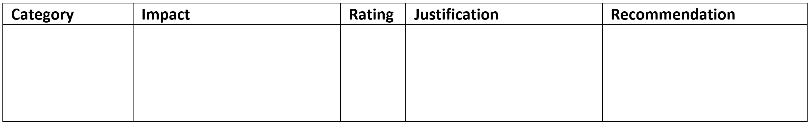

# Unit 1: Assess Impacts

In the Exploration phase of the EDGE process, you would have identified desired personal, social, economic and environmental impacts. You now need to consider how successful the project has been in achieving these. 

## Assessing Feedback
There are two ways that these impacts can be assessed
- feedback
- reasoned speculation

**Feedback**   
- some impacts are immediate and you can ask users if they experienced the impact
- for example: do you feel the application improved your health and well-being?
- you will justify this type of assessment, with evidence of user feedback (summary etc)

**Reasoned Speculation**
- some impact are beyond you capacity to assess (eg. reduction in the impacts of climate change)
- for these types of impacts, you will need to express a **justified** opinion on its impact
- the justification should identify the mechanism of the impact, or an example of a similar process.
    
Irrespective of the type of assessment, you will need to rate the success of the application achieving each impact. This is best done in a table.

