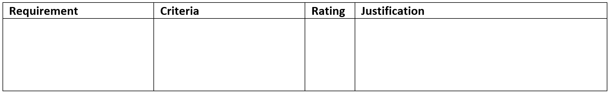

# Evaluate Solution

```{admonition} Tools use:
:class: attention
- solution evaluation table
```

## For Units 1 to 4
Create a Solutions Evaluation table for both the prescribed criteria and the self-determined criteria. Copy all the of the requirements and criteria you established in the Explore phase.




```{admonition} Unit 1 subject matter covered:
- evaluate and make recommendations about the implemented solution against prescribed criteria, maintainability and useability principles
{cite}`queenslandcurriculumassessmentauthority_2017_digital`
```

```{admonition} Unit 3 subject matter covered:
- appraise the suitability of prescribed and self-determined criteria
{cite}`queenslandcurriculumassessmentauthority_2017_digital`
```