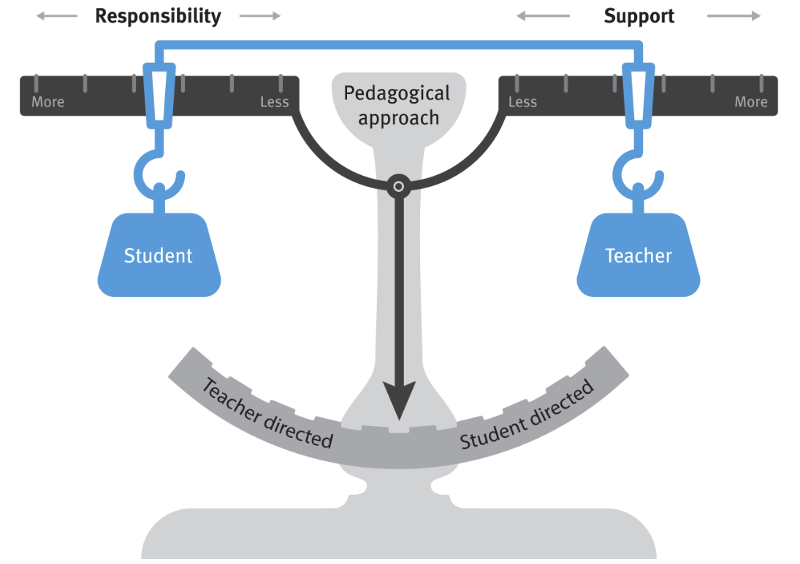

# EDGE approach to Digital Solutions

Digital Solutions is a subject that implements a problem-based learning framework.

> Central to problem-based learning is the provision or identification of suitably challenging, subject-specific, context-relevant, real-world problems. Student engagement with these problems facilitates student learning of Digital Solutions subject matter. (syllabus)

To engage in these problems Digital solutions prescribes a specific problem-solving process - EDGE (Explore, Develop, Generate and Evaluate).

> The process is iterative, proceeds through a number of phases, requiring students to explore problems, develop ideas, generate components and digital solutions, and evaluate personal, social and economic impacts, components and digital solutions. (syllabus)

## The Text Structure
In this text students will learn the Digital Solutions content, through the application of the EDGE processes. The process has been broken down into sub-phases. Students will navigate these phases for each of the four unit, applying the process to a sample problem and developing the required skills, whilst learning the content.

### Digital Solutions Units

#### Unit 1: Creating with code
In Unit 1, students will explore the creative and technical aspects of developing interactive digital solutions. They investigate algorithms, programming features and useability principles to generate small interactive solutions using programming tools and gain a practical understanding of programming features. This allows them the opportunity to explore existing and developing trends involving digital technologies. 

#### Unit 2: Application and data solutions
In Unit 2, students are required to engage with and learn subject matter through the use of the various phases of the problem-solving process in Digital Solutions. Students will optimise a given database and use programming skills acquired in Unit 1 to write procedural text-based code to generate a solution that interacts with an existing database via structured query language (SQL). Students will plan, develop and generate the interface and code to enable the user to insert, update, retrieve and delete data using an existing database via SQL. Prior to inserting the data, the system will validate the data being entered to ensure its integrity and reliability for use and storage. Retrieved data will be displayed to the user in an appropriate format, such as text or a symbolic visual form.

Students are required to understand the structure of a database, along with how primary and foreign keys and data types affect the performance of the database. Students will evaluate the security, privacy and ethical effects of storing data in databases from individual, organisational and government perspectives.

#### Unit 3: Digital innovation
In Unit 3, students are required to engage with and learn subject matter through the use of the various phases of the problem-solving process in Digital Solutions. Students analyse the requirements of particular groups of people, and use knowledge and skills of problem-solving, computational, design and systems thinking. They will determine data requirements and use available resources to create prototyped digital solutions by programming and developing user interfaces to improve user experiences.

#### Unit 4: Digital impacts
In Unit 4, students learn how data is shared in both local and global contexts, particularly how digital solutions are increasingly required to exchange data securely and efficiently. Students will understand elements of cybersecurity by exploring the conditions, environment and methods for enabling data to flow between different digital systems. They will analyse data privacy and data integrity risks associated with transferring data between applications and evaluate the personal, social and economic impacts associated with the use and availability of both public and private data. Students will develop an application that simulates the exchange of data between two applications.

### EDGE Phases
Below are the four phases, and their sub-phases, as used by this text. There is an additional phase which addresses syllabus content that is used through the EDGE process.

#### Explore
- Describe the problem
- Determine human needs or wants
- Analyse the problem
- Select Impacts
- Identify Constraints
- Identify Requirements
- Determine Criteria

#### Develop
- Design UI and UX
- Design Algorithms
- Design Data Source

#### Generate
- Select Development Environment
- Generate Code
- Clarify Code
- Test Code

#### Evaluate
- Evaluate Components
- Assess Impacts
- Evaluate Solution

#### Throughout
- Communicate
- Use Project Conventions
- Use Gramma and Language Structures
- Use Technical Language
- Apply Referencing